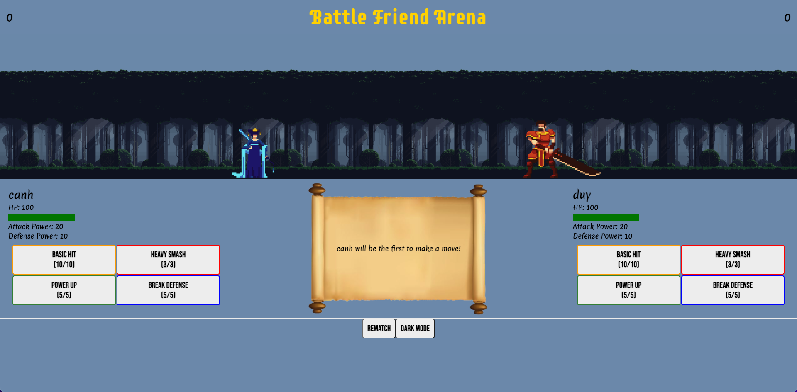
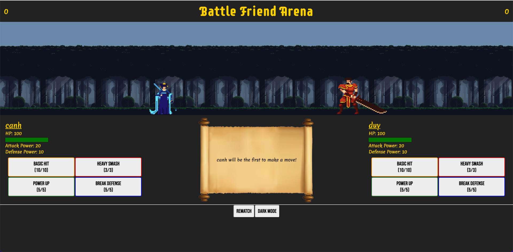
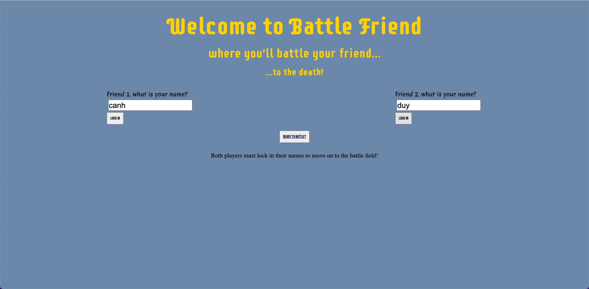

# **Battle Friend RPG**

Unit 1 Project: Javascript Game

## Date: 3/5/2022

### By: Canh Vo

### [Github](https://github.com/canhvo16)

### [LinkedIn](https://www.linkedin.com/in/canh-vo-056122188/)

### [Trello](https://trello.com/b/hDGxvdFV/battle-friend-rpg)

---

### **_Description_**

#### The game that I have chosen for my Unit 1 project of Week 3 in GA's SEIR bootcamp is to build a simple RPG or Role-Playing Game using vanilla JavaScript. It will be a 2-player turn-based game where players will fight to the death with 4 given abilities. I've added features where players can add their names to their characters. They are able to have a remtach at any point in the battle and switch between dark and light modes. The scene is that your friend has done unspeakable actions to betray your trust and you feel that there is no way you can live in the same world as them. You must battle him/her/they to the death for your sanity and vengeance!

---

### **_Technologies_**

- HTML
- CSS
- Javascript
  - DOM Manipulation
  - OOP

---

### **_How to Get Started_**

- First I worked on the the main game HTML and created the necessary elements to have a playable game. This included building a set of buttons and a way to differentiate which buttons belonged to which character.
- Once the buttons are set up, I worked on the corresponding JavaScript file. Player characters were created using objects and each object included a player's offensive and defensive stat. It also included a set of 4 moves which were set as methods to be called upon using buttons from the HTML file.
- Each player will take turns making moves and only 1 move can be made at a time, so I made it in a way that both players are not able to choose their turns at the same time and can only choose 1 ability.
- I made an element that shows the health of the player so that when it hits 0 or below, the game will know that the battle has ended, a winner will be declared, and a tally will be added to the scoreboard. As an added feature I also made the players’ offensive and defensive stats visible in the game as there are moves that change that stat.

- The game includes a rematch button that resets all values back to what they were from the beginning and there is a dark mode included for those that prefer to play with a darker background.

- I found free sprites (game characters) and backgrounds to set as the visuals of the game.
- When creating the landing page of the game, I placed input boxes where players can personalize their characters by adding a name to their characters. When both players lock in the name for their character, a ready to battle button will pop up that will send them to the main game.

---

### **_Credits_**

Sprites: [chierit](https://chierit.itch.io/)

Background Image: [edermunizz](https://edermunizz.itch.io/)

Scroll Image: [PNG All](https://www.pngall.com/scroll-png)

Animations: [Chris Inn](https://www.ciharath.com/)
